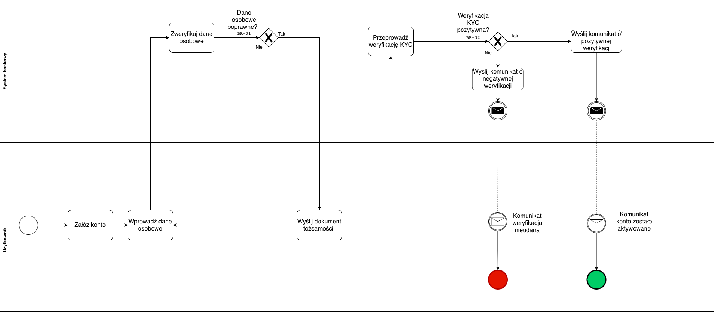

##  BPMN_01_Onboarding_KYC

###  Cel procesu
Proces przedstawia ścieżkę założenia konta osobistego przez nowego użytkownika w systemie bankowym.  
Celem jest potwierdzenie tożsamości klienta w ramach procedury **KYC (Know Your Customer)** oraz aktywacja konta po pozytywnej weryfikacji danych.

---

###  Opis przebiegu procesu

1. **Użytkownik** inicjuje proces, wybierając opcję **„Załóż konto”**.  
2. Wprowadza wymagane **dane osobowe**, które następnie trafiają do **systemu bankowego**.  
3. System dokonuje **weryfikacji danych osobowych (BR-01)** – jeśli są niepoprawne, użytkownik zostaje poproszony o korektę.  
4. Po poprawnym wprowadzeniu danych użytkownik **wysyła dokument tożsamości** (np. zdjęcie dowodu, selfie).  
5. System przeprowadza **weryfikację KYC (BR-02)**, analizując przesłane dane i dokumenty.  
6. Po decyzji weryfikacyjnej system wysyła komunikat:  
   - **Pozytywny wynik** → Konto zostaje aktywowane,  
   - **Negatywny wynik** → Konto zostaje odrzucone, a użytkownik otrzymuje powiadomienie o niepowodzeniu.  
7. Proces kończy się w zależności od wyniku (zielony lub czerwony end event).

---

###  Uczestnicy procesu
| Rola | Odpowiedzialność |
|------|------------------|
|  **Użytkownik** | Wprowadzenie danych osobowych, przesłanie dokumentu, odbiór komunikatów |
|  **System bankowy** | Walidacja danych, weryfikacja KYC, wysyłka komunikatów o wyniku |

---

###  Reguły biznesowe
| ID | Nazwa | Opis |
|----|--------|------|
| **BR-01** | Poprawność danych osobowych | Wszystkie dane muszą być zgodne z dokumentem tożsamości i poprawnie sformatowane. |
| **BR-02** | Limit czasu weryfikacji KYC | Proces KYC powinien zostać zakończony w czasie ≤ 24h. |

---

###  Notacja
- Notacja: **BPMN 2.0**  
- Oprogramowanie: [app.diagrams.net](https://app.diagrams.net/)  
- Użyte elementy: **swimlane’y, bramki decyzyjne, message flow, reguły biznesowe (BR-xx)**  

---

---

###  Komentarz analityczny
Proces Onboarding/KYC to punkt wejścia do całego systemu bankowego.  
Łączy aspekt **użytkownika (interfejs)** i **systemu (automatyczna weryfikacja)**, co pozwala pokazać zrozumienie przepływów danych i reguł decyzyjnych w projekcie.  
Model ten może być dalej rozwijany o elementy **AML**, **Fraud Detection** oraz integrację z modułem **przelewów**.
