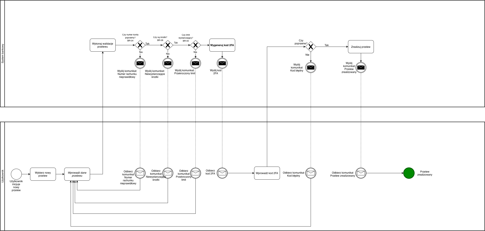

# BPMN_02_Przelew_Krajowy

##  Cel procesu
Proces przedstawia obsługę przelewu krajowego z wykorzystaniem wieloetapowej weryfikacji danych, zabezpieczenia 2FA.  
Model uwzględnia realistyczne zachowanie systemu bankowego, komunikację z użytkownikiem oraz scenariusze błędne prowadzące do ponowienia czynności.

---

## 🔄 Opis przebiegu procesu

1. **Użytkownik** inicjuje proces, wybierając opcję **„Nowy przelew”**.
2. Wprowadza dane przelewu (odbiorca, numer konta, kwota, tytuł).
3. **System** wykonuje kolejno trzy walidacje:
   - **BR-04**: poprawność numeru konta (IBAN/NRB),
   - **BR-06**: dostępne środki ≥ kwota transakcji,
   - **BR-05**: limit dzienny nieprzekroczony (≤ 20 000 PLN).
   W przypadku błędów system wysyła komunikat do użytkownika, a proces wraca do ponownego wprowadzenia danych.
4. Po pozytywnych walidacjach użytkownik przechodzi proces **2FA**:
   - System generuje i wysyła kod 2FA,
   - Użytkownik odbiera kod i wprowadza go w aplikacji.
5. System weryfikuje kod 2FA:
   - Jeśli kod **niepoprawny** → użytkownik może wprowadzić dane jeszcze raz,
6. Po prawidłowej weryfikacji 2FA system realizuje przelew.

---

##  Reguły biznesowe

| ID | Nazwa | Opis |
|----|--------|------|
| **BR-04** | Poprawność numeru konta | Numer konta musi spełniać reguły IBAN/NRB. |
| **BR-06** | Wystarczające środki | Saldo konta ≥ kwota przelewu. |
| **BR-05** | Limit dzienny | Maksymalny dzienny limit przelewów: 20 000 PLN. |

---

##  Podgląd diagramu

