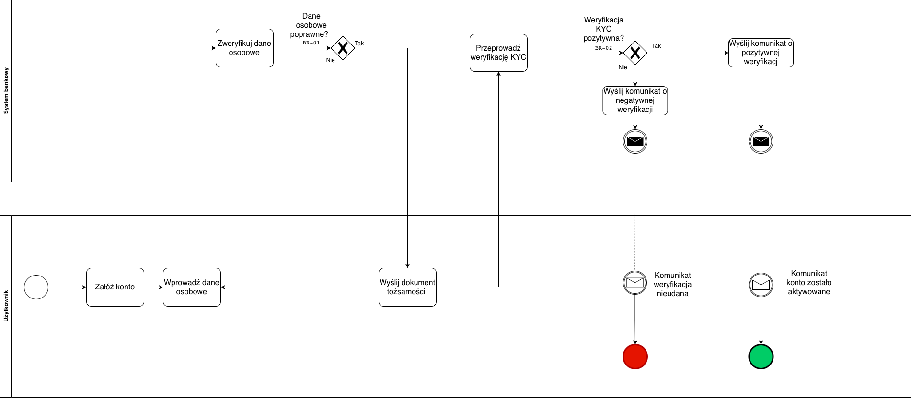

#  Procesy biznesowe (BPMN)

Folder zawiera modele procesów biznesowych opracowane w notacji **BPMN 2.0**.  
Każdy proces opisuje główne funkcjonalności systemu obsługi konta osobistego i przelewów krajowych w ramach projektu bankowego (MVP).

---

##  Zawartość

| Plik | Opis | Główne bramki / reguły biznesowe |
|------|------|-----------------------------------|
| **BPMN_01_Onboarding_KYC.drawio** | Proces zakładania konta i weryfikacji tożsamości (KYC). | BR-01 – dane osobowe poprawne BR-02 – weryfikacja KYC ≤ 24h |
| **BPMN_02_Przelew_Krajowy.drawio** | Proces wykonania przelewu krajowego, uwzględniający ścieżkę główną i wyjątki (brak środków, limit, błąd). | BR-04 – poprawność konta IBAN BR-05 – limit dzienny 20 000 PLN BR-06 – saldo ≥ kwota przelewu |
| **BPMN_03_Reklamacja_Przewelu.drawio** | Proces zgłaszania i obsługi reklamacji przelewu. | BR-08 – reklamacja do 30 dni BR-09 – rozpatrzenie w 14 dni BR-10 – tylko właściciel może zgłosić reklamację |

---

##  Notacja i konwencje

- Diagramy opracowano w **draw.io (app.diagrams.net)** w standardzie **BPMN 2.0**.  
- Użyto **swimlane’ów** do rozdzielenia ról:  
  -  *Użytkownik*  
  -  *System bankowy*  
  -  *Dział obsługi klienta* (w procesie reklamacji)
- Komunikacja między uczestnikami przedstawiona za pomocą **message flow** (linie przerywane z kopertą ✉️).  
- Bramki decyzyjne zawierają powiązane **reguły biznesowe (BR-xx)**.  
- Każdy diagram zawiera punkty początkowe, końcowe i alternatywne ścieżki procesu.

---

---

##  Cel folderu

Celem folderu `03-bpmn` jest przedstawienie kluczowych procesów biznesowych w sposób:
- **czytelny** dla zespołów biznesowych i deweloperskich,  
- **spójny** z wymaganiami funkcjonalnymi (`fr.md`),  
- **gotowy** do wykorzystania w dalszej analizie systemowej (np. UML, model danych, API).
