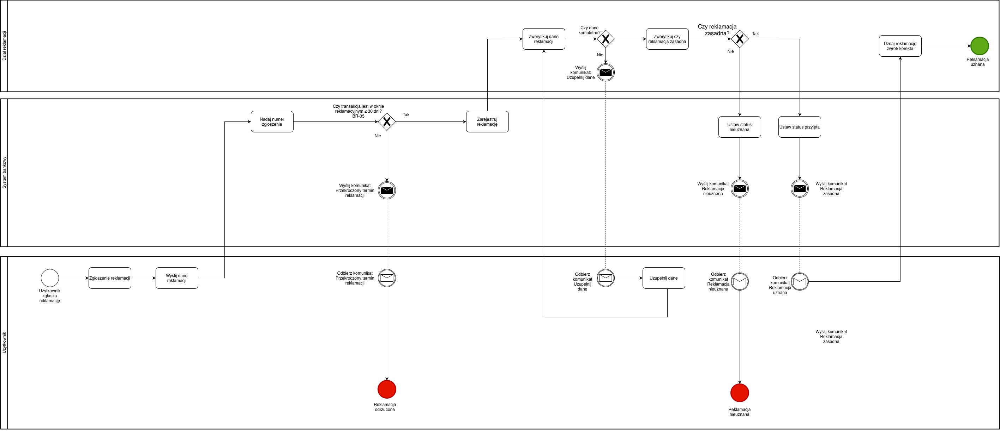

#  BPMN_03_Reklamacja_Przelewu 

##  Cel procesu

Proces przedstawia zgłoszenie reklamacji przelewu przez użytkownika, weryfikację warunków formalnych oraz analizę zasadności przez dział obsługi.  
Celem jest ustalenie, czy reklamacja zostanie uznana, czy odrzucona, a następnie poinformowanie użytkownika o decyzji.

---

##  Opis przebiegu procesu

1. **Użytkownik** inicjuje zgłoszenie reklamacji poprzez aplikację.
2. Wprowadza dane wymagane do rozpoczęcia procesu (ID transakcji, opis).
3. **System** rejestruje zgłoszenie i nadaje numer sprawy.
4. System weryfikuje, czy transakcja mieści się w dozwolonym oknie czasowym (**BR-05: 30 dni**).
   - Jeśli **NIE** → system informuje użytkownika o odrzuceniu reklamacji z powodu przekroczenia terminu → proces kończy się niepowodzeniem.
   - Jeśli **TAK** → zgłoszenie zostaje przekazane do działu obsługi.
5. **Dział Obsługi** sprawdza kompletność danych:
   - Jeśli brakuje informacji, system wysyła komunikat o uzupełnienie → użytkownik uzupełnia dane → proces powraca do weryfikacji kompletności.
   - Jeśli dane są kompletne → przechodzi do analizy merytorycznej.
6. **Dział Obsługi** ocenia zasadność reklamacji:
   - Jeśli **niezasadna** → system ustawia status "Odrzucona" oraz wysyła komunikat o decyzji.
   - Jeśli **zasadna** → system ustawia status "Uznana", może wykonać operację korekty/zwrotu środków oraz wysyła komunikat do użytkownika.
7. Proces kończy się w odpowiednim stanie:
   - ✅ Reklamacja **Uznana**
   - ❌ Reklamacja **Odrzucona**
   - ❌ Reklamacja **Po terminie**

---

##  Uczestnicy procesu (Swimlane’y)

| Rola | Odpowiedzialność |
|------|------------------|
|  **Użytkownik** | Zgłasza reklamację, uzupełnia dane, odbiera decyzję |
|  **System bankowy** | Rejestruje reklamację, weryfikuje datę, wysyła komunikaty, ustawia statusy |
|  **Dział obsługi** | Analizuje zgłoszenie, podejmuje decyzję merytoryczną |

---

##  Reguły biznesowe

| ID | Nazwa | Opis |
|----|--------|------|
| **BR-05** | Claim window | Reklamację można złożyć w ciągu **30 dni** od daty wykonania transakcji. |

---

##  Warunki decyzyjne (Gateways)

| Decyzja | Ścieżka Tak | Ścieżka Nie |
|---------|--------------|-------------|
| Czy reklamacja mieści się w oknie BR-05? | Zarejestruj i przekaż do analizy | Odrzuć reklamację i poinformuj użytkownika |
| Czy dane reklamacji są kompletne? | Analiza merytoryczna | Wyślij prośbę o uzupełnienie danych |
| Czy reklamacja jest zasadna? | Ustaw status Uznana + korekta | Ustaw status Odrzucona |

---

## Komunikaty (Message Flow)

Komunikacja między uczestnikami odbywa się poprzez:

- **System → Użytkownik**:
  - Prośba o uzupełnienie danych
  - Decyzja: reklamacja odrzucona
  - Decyzja: reklamacja uznana
  - Odrzucenie z powodu terminu BR-05

- **System → Dział Obsługi**:
  - Przekazanie zgłoszenia do analizy

---

```markdown

