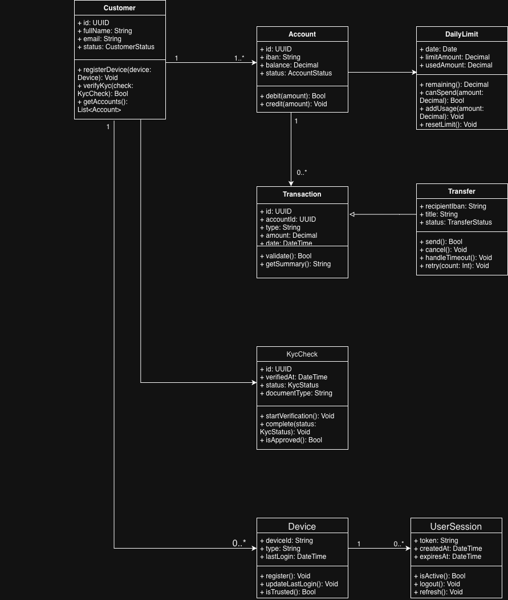

### Class Diagram – Mini-bank: struktura domenowa

Diagram przedstawia główne klasy systemu bankowego związanego z obsługą kont i przelewów.  
Model obejmuje relacje między klientem, kontem, transakcjami, limitami dziennymi oraz mechanizmami bezpieczeństwa (urządzenia, sesje).

Kluczowe reguły biznesowe:
- BR-01/02 – kontrola limitu dziennego (klasa `DailyLimit`)
- BR-03 – weryfikacja środków (`Account.balance`)
- BR-04 – aktywacja konta po pozytywnym KYC (`KycCheck`)
- BR-06 – audyt logowań i transakcji (`UserSession`)
- BR-07 – obsługa timeout operatora (`Transfer.status = PENDING`)

